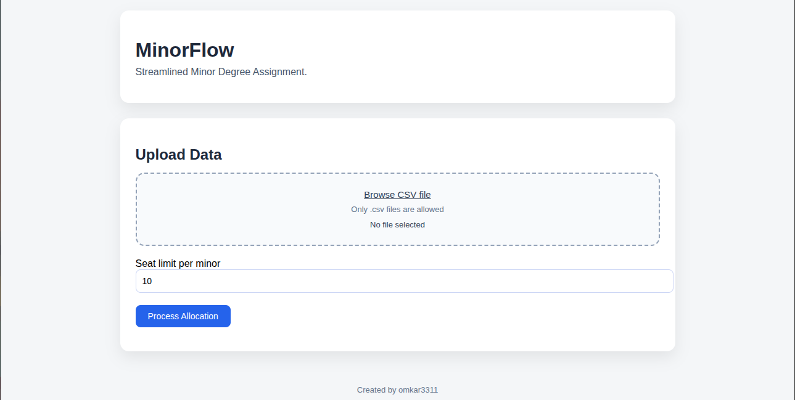

# MinorFlow

**MinorFlow** is a lightweight web application that automates the allocation of minor degrees to students based on academic performance, preferences, and seat availability.

It is designed to be fast, fair, and easy to use—ideal for academic institutions or internal administrative workflows.

---
## 📸 Preview




## 🚀 Features

- Upload student data via CSV
- Configure seat limits per minor program
- Automatic minor allocation based on:
  - Backlogs (ascending)
  - Percentage (descending)
  - Student preferences
- Real-time result display
- Download final allocation as CSV
- No file storage (in-memory processing only)

---

## 🛠 Tech Stack

- **Backend:** FastAPI
- **Frontend:** HTML, CSS, JavaScript
- **Data Processing:** Pandas
- **Server:** Uvicorn

---

## 📁 Project Structure

```text
project/
│
├── main.py
├── templates/
│   └── index.html
└── README.md
```
## 📄 CSV Format (Required)

Your input CSV file **must** contain the following columns.  
Column names are **case-sensitive**.

| Column Name | Description |
|------------|-------------|
| Branch | Student’s major branch |
| Backlog | Number of active backlogs |
| Percentage | Academic percentage |
| Choice1 | First minor preference |
| Choice2 | Second minor preference |
| Choice3 | Third minor preference |

If any of these columns are missing or misspelled, the allocation process will fail.

---

## ⚙️ Allocation Logic

The minor degree allocation follows a deterministic and fair rule-based approach:

1. Students are first sorted by:
   - **Backlog** (ascending)
   - **Percentage** (descending)

2. Seats for each minor are initialized based on the provided seat limit.

3. For each student:
   - Preferences are checked in order: `Choice1 → Choice2 → Choice3`
   - If a preferred minor has available seats, it is assigned
   - If none of the preferences are available, the next available minor is assigned

4. Final results are sorted by:
   - Branch
   - Backlog
   - Percentage

---
